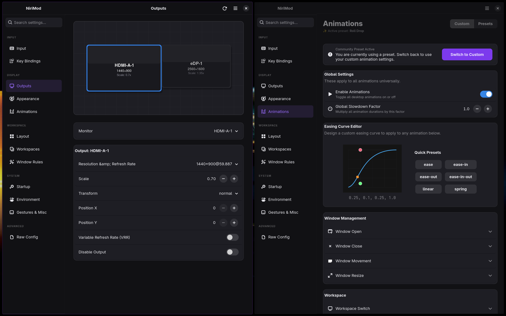
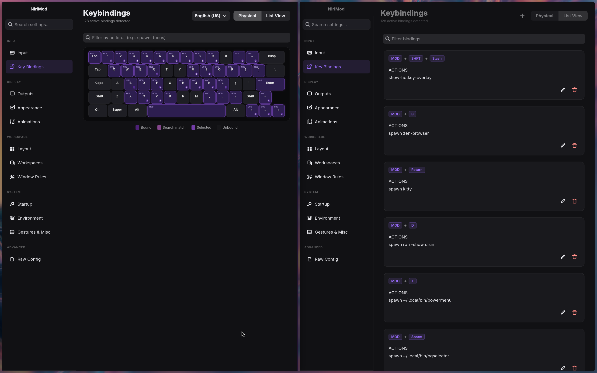
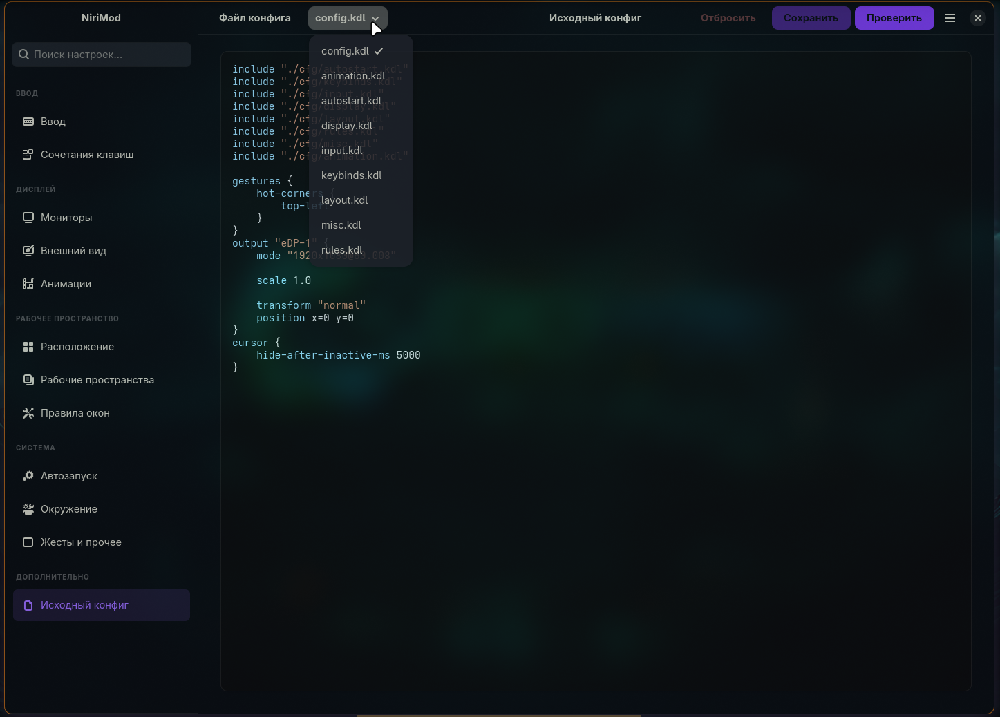

<div align="center">
  <h1>NiriMod</h1>
  
  **A GTK4/libadwaita config manager for the [niri](https://github.com/niri-wm/niri) Wayland compositor.**

  [](LICENSE)
  [](https://python.org)
  [](https://gtk.org)
  [](https://wayland.freedesktop.org)
</div>

<br>



Editing Niri's configuration file by hand works perfectly fine—until you find yourself tweaking animation curves blindly, guessing the exact names of your monitors, or accidentally overlapping your keybinds. NiriMod steps in to provide a clean, native GUI for the tedious parts of configuration, while staying completely out of the way for everything else.

---

## What It Does

NiriMod manages your Niri config via a clean interface, allowing you to easily adjust settings while leaving your custom scripts and comments alone.

- **Display Outputs:** Visually arrange your monitors using drag-and-drop. Easily adjust your resolution, refresh rate, variable refresh rate (VRR), and fractional scaling without diving into the config file.
- **Keybinds:** Manage your shortcuts through an interactive physical keyboard map that lights up bound keys, or use the searchable list view to quickly find and edit specific bindings.
- **Layout & Rules:** Take control of Niri's column layout with a full editor for window rules, column proportions, gaps, struts, and workspaces.
- **System & Input:** Adjust your mouse and touchpad settings, configure swipe gestures, change cursor themes, and manage the environment variables and startup commands Niri uses.
- **Animations:** Stop guessing cubic-bezier values. The visual easing curve editor provides live previews for all of Niri's animation slots (like window open/close or workspace switches).
- **Raw Config Editor:** Sometimes you just want to type. The built-in KDL text editor comes with undo/redo functionality and runs live validation to ensure your manual tweaks are safe.



---

## Safe, Non-Destructive Editing

We built NiriMod to be strictly non-destructive. It is designed to never break your existing configuration:

- **Strict Validation:** Before anything is written to disk, NiriMod runs `niri validate`. If the validation fails, nothing is saved, keeping your setup safe.
- **Atomic Writes:** Configuration files are saved using temporary files first, which prevents corruption if a save is interrupted.
- **Comment Preservation:** Your custom comments and whitespace formatting are kept completely intact. We don't overwrite your personal notes.
- **Profile Management:** Easily save and switch between full configuration snapshots (like a "work" profile and a "gaming" profile) with a single click.

### Third-Party Shells & Multi-File Configs



NiriMod natively supports advanced, multi-file setups. This includes custom visual layers and desktop shells like **Dank Material Shell (DMS)** and **Noctalia**. 

If you like to split your configuration using `include` directives, NiriMod handles that transparently. It can parse included files up to 5 levels deep. When you make a change in the user interface, NiriMod is smart enough to track which file that specific setting came from, and it saves the change back to its exact origin. 

Because NiriMod only touches the standard Niri settings it understands, your custom shell configurations, advanced scripts, and unrecognized blocks are perfectly preserved just the way you left them.

---

## Installation

### AUR (Arch Linux)

```bash
yay -S nirimod-git
```

### Script (Other Distros)

```bash
curl -sSL https://raw.githubusercontent.com/srinivasr/nirimod/main/install.sh | bash
```

*(You can use `--install` to skip the prompts, `--uninstall` to remove the application, or `--skip-deps` if you prefer to handle dependencies manually).*

---

## Requirements

NiriMod works out of the box on Arch, Fedora, openSUSE, and Debian/Ubuntu. You will need:
- Python 3.12+ and `uv` (the install script handles `uv` for you)
- GTK4, libadwaita, PyGObject, and Pycairo
- The niri Wayland compositor

**Gentoo Users** (requires the [GURU overlay](https://wiki.gentoo.org/wiki/Project:GURU) for `niri`):
```bash
emerge dev-vcs/git net-misc/curl dev-lang/python gui-libs/gtk gui-libs/libadwaita dev-python/pygobject dev-python/pycairo x11-libs/libxkbcommon x11-misc/xkeyboard-config
curl -sSL https://raw.githubusercontent.com/srinivasr/nirimod/main/install.sh | bash -s -- --install --skip-deps
```

---

## Contributing

Contributions are always welcome. If you would like to help out, please check the [CONTRIBUTING.md](CONTRIBUTING.md) file for setup instructions. If you are planning a major change, please open an issue first so we can discuss it.

<a href="https://www.star-history.com/?repos=srinivasr%2Fnirimod&type=date&legend=top-left">
 <picture>
   <source media="(prefers-color-scheme: dark)" srcset="https://api.star-history.com/chart?repos=srinivasr/nirimod&type=date&theme=dark&legend=top-left" />
   <source media="(prefers-color-scheme: light)" srcset="https://api.star-history.com/chart?repos=srinivasr/nirimod&type=date&legend=top-left" />
   
 </picture>
</a>

---

*NiriMod is an independent project and is not affiliated with the official niri team.*
